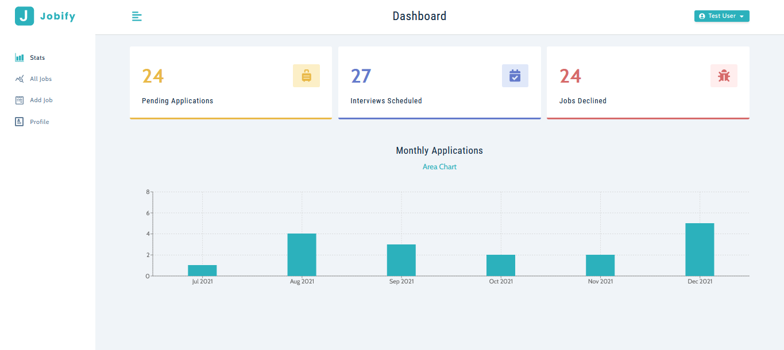

# Jobify

#### Track Your Job Search

Here is the Live Project - [Jobify](https://jobify-k454.onrender.com/)

<p align="center">
  
  &nbsp; &nbsp; &nbsp;
</p>
<p align="center">
  
  &nbsp; &nbsp; &nbsp;
  
</p>
<p align="center">
  
  &nbsp; &nbsp; &nbsp;
  
</p>

#### Run The App Locally


```sh
npm run install-dependencies
```

- create .env file
- setup values for - MONGO_URL, JWT_SECRET, JWT_LIFETIME

```sh
npm start
```

- visit url http://localhost:3000/
